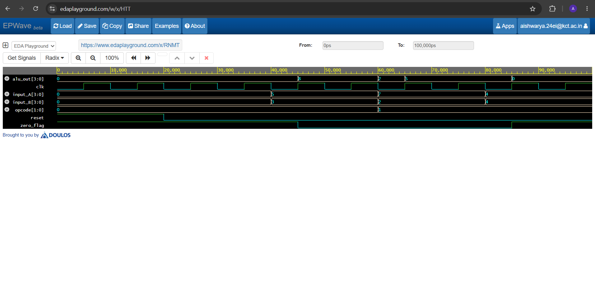

# Design and Simulation of a 4-Bit Processor using VHDL

## 🚀 Project Overview
This repository contains the VHDL design and simulation of a structural **4-Bit Processor (CPU)**. The project was designed, debugged, and verified entirely online using the **EDA Playground** environment with the **GHDL** compiler toolchain as part of my digital electronics internship evaluation.

## 🧠 Processor Architecture & Instruction Set
The architecture integrates a central Arithmetic Logic Unit (ALU), memory control routing, and dedicated internal registers (`reg_A` and `reg_B`) to process math and logic commands synchronized to a master system clock.

| Opcode | Operation | Functional Description |
| :--- | :--- | :--- |
| `00` | **ADD** | Adds Input A and Input B |
| `01` | **SUB** | Subtracts Input B from Input A |
| `10` | **AND** | Bitwise logical AND execution |
| `11` | **OR** | Bitwise logical OR execution |

## 📊 Simulation Waveform Verification
The system's control logic was rigorously tested by cycling through separate instructions. The timeline confirms that when `opcode` is set to `00` (ADD), the processor correctly takes inputs `5` and `3` on the active clock edge to output `8` on the `alu_out` bus.

### EPWave Timing Diagram

